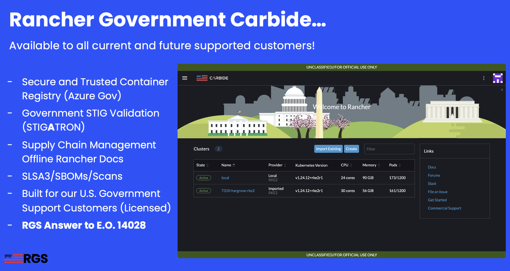

# Source Code Technology Review Day

### Table of Contents
* [Introduction](#introduction)
* [Contact Information](#contact-information)
* [Overview and Content](#overview-and-content)

## Introduction

Rancher is a complete open source software stack for teams adopting containers. It addresses the operational and security challenges of managing multiple Kubernetes clusters at scale, while providing DevOps teams with integrated tools for running containerized workloads.

Rancher Government Solutions is specifically designed to address the unique security and operational needs of the U.S. Government and military as it relates to application modernization, containers, and Kubernetes.

RGS supports all Rancher products with U.S. based American citizens with the highest security clearances who are currently supporting programs across the Department of Defense, Intelligence Community, and civilian agencies.

## Contact Information

* National Security Team Alias
  * natsec@rancherfederal.com
* Rob Norton, Director of Special Programs (NatSec)
  * rob.norton@ranchergovernment.com
* Mike Sellers, Account Executive
  * michael.sellers@ranchergovernment.com
* Zack Brady, Field Engineer, NatSec Team
  * zack.brady@ranchergovernment.com
* Andy Clemenko, Senior Field Engineer/Security Lead, NatSec Team
  * andy.clemenko@ranchergovernment.com

## Overview and Content

### Interesting Articles and Demos
* Rancher Tactical Edge Article
  * https://intelligencecommunitynews.com/ic-insiders-tactical-edge-reference-architecture/
* Rancher "MaxPower" Edge Deployment Video
  * https://www.youtube.com/watch?v=Qdc_HKXacyM&t=4s
* Rancher RKE2/MCM STIG Article
  * https://intelligencecommunitynews.com/ic-insiders-have-you-stigd-your-kubernetes-yet
* Rancher on AWS Article
  * https://ranchergovernment.com/blog/aws-govcloud
* Rancher Reference Architecture Article
  * https://github.com/clemenko/rancher-ref-arch
* Rancher Airgap Install Guide (POC)
  * https://github.com/clemenko/rke_airgap_install
* Rancher Effortless Install Guide
  * https://github.com/zackbradys/rancher-effortless
* Rancher on AWS Terraform Install Guide
  * https://github.com/zackbradys/aws-rke2-terraform

### Product Stack and Docs
* Rancher Government Solutions
  * Site: https://ranchergovernment.com
* Rancher Government Carbide
  * Site: https://ranchergovernment.com/carbide
  * Docs: https://ranchercarbide.dev
* Rancher Kubernetes Engine 2 (RKE2)
  * Site: https://ranchergovernment.com/products/rke2
  * Docs: https://docs.rke2.io
* Rancher Multi-Cluster Manager (MCM)
  * Site: https://ranchergovernment.com/products/mcm
  * Docs: https://ranchermanager.docs.rancher.com
* Rancher Longhorn (Storage)
  * Site: https://ranchergovernment.com/products/longhorn
  * Docs: https://docs.longhorn.io
* Rancher NeuVector (Security)
  * Site: https://ranchergovernment.com/neuvector
  * Docs: https://open-docs.neuvector.com

### Rancher Government Carbide Features

### Example High Level Architecture Diagram

